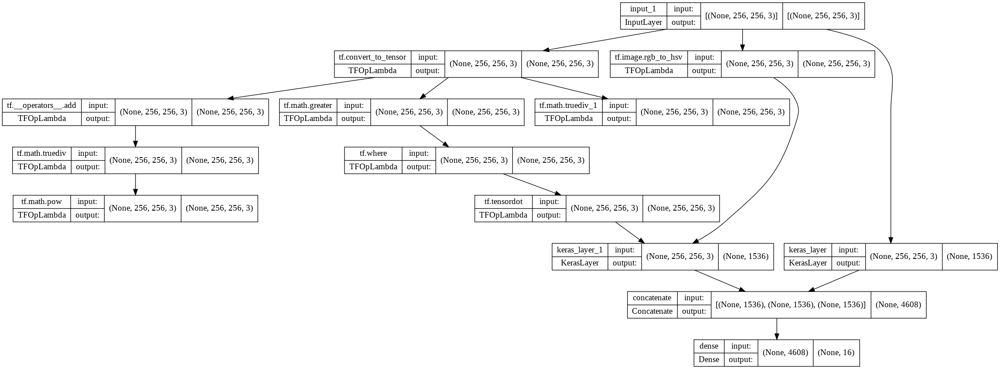
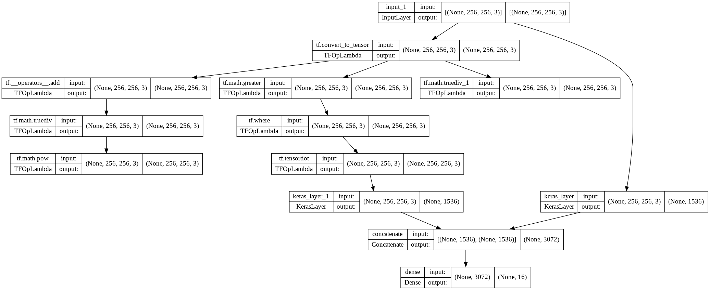

# Vehicle Color Recognition
A deep learning model for car color classification with 16 classes.


## Data
This model is trianed by [Shenasa.ia](https://shenasa-ai.ir/) cars dataset (which is private) and [VCoR](https://www.kaggle.com/datasets/landrykezebou/vcor-vehicle-color-recognition-dataset) (Vehicle Color Recognition) Dataset from kaggle.

Images are resized to 256x256 and some classes are omitted due to appropriate combination.

## Classes
There are 16 classes as below:

|      |color    |train|validation|total|
|------|---------|-----|----------|-----|
|1     |beige    |950  |124       |1074 |
|2     |black    |1235 |298       |1533 |
|3     |blue     |1102 |275       |1377 |
|4     |brown    |951  |237       |1188 |
|5     |cream    |900  |33        |933  |
|6     |crimson  |892  |9         |901  |
|7     |gold     |900  |25        |925  |
|8     |green    |804  |46        |850  |
|9     |grey     |1373 |343       |1716 |
|10    |navy-blue|870  |45        |915  |
|11    |orange   |762  |47        |809  |
|12    |red      |1040 |259       |1299 |
|13    |silver   |845  |211       |1056 |
|14    |titanium |900  |54        |954  |
|15    |white    |5744 |1435      |7179 |
|16    |yellow   |824  |54        |878  |


## Architecture
I have used 3 model architecture which use [R50x1](https://tfhub.dev/google/bit/s-r50x1/1) tensorflow hub layer for feature extraction. 

### RGB Architecture


### Combination of RGB, XYZ and HSV (combined-v1)


### Combination of RGB, XYZ (combined-v2)



Among these three architectures, the RGB model has the best result, so the final architecture is the first one (i.e. RGB Architecture)


# How To Use This Model
### 1. Install Docker
This model is going to serve with [tensorflow serving](https://www.tensorflow.org/tfx/guide/serving), thus you need to install docker.

These are docker installation instruction for:
* [Windows ](https://docs.docker.com/desktop/windows/install/)
* [Linux](https://docs.docker.com/desktop/linux/install/)
* [macOS](https://docs.docker.com/desktop/mac/install/)

### 2. Clone The Project
```bash
git clone https://github.com/m-bashari-m/vehicle-color-recognition.git
```
After cloning the project, change current directory to vehicle-color-recognition directory.
```bash
cd vehicle-color-recognition
```

### 3. Install TensorFlow Serving

```bash
docker pull tensorflow/serving
```
### 4. Create A Docker Network
```bash
docker network create model-net
```
### 5. Run TensorFlow Serving
```bash
docker run -it --rm  \
           -v /path/to/vehicle-color-recognition/model:/models/vcor \
           -e MODEL_NAME=vcor \
           --name tf-serving \
           --net model-net  \
           tensorflow/serving
```

### 6. Build App Image
```bash
docker build -t vcor .
```
### 7. Run App
Followig command will run the app.
```bash
docker run -it --rm -p 8080:8080 -v /path/to/data:/data --net model-net vcor
```

### 8. Get Predictions
Finally use the following link to get predictions:

[`http://localhost:8080`](http://localhost:8080)
